[](https://circleci.com/gh/miykael/fmriflows/tree/master)
[](https://github.com/miykael/fmriflows/issues/)
[](https://github.com/miykael/fmriflows/pulls/)
[](https://GitHub.com/miykael/fmriflows/graphs/contributors/)
[](https://github.com/miykael/fmriflows/commits/master)
[](https://github.com/miykael/fmriflows/archive/master.zip)
[](https://hub.docker.com/r/miykael/fmriflows/)
[](http://hits.dwyl.io/miykael/fmriflows)

# fmriflows


**`fmriflows`** is a collection of fully autonomous uni- & multivariate fMRI processing pipelines. This comprises anatomical and functional preprocessing, estimation of singal confounds, as well as univariate and multivariate analysis on the subject and group level.

As is rather obvious, `fmriflows` was greatly inspired by [fmriprep](https://github.com/poldracklab/fmriprep) and other open source projects and borrows strongly from their ideas and solutions. But while [fmriprep](https://github.com/poldracklab/fmriprep) can be described as a "glass" box software, `fmriflows` is more like a shoebox. Simple to open, easy to understand what's inside and uncomplicated to replace and change components inside. This is all due to the fact that all the source code of `fmriflows` is stored within the notebooks.

# Installation and Usage

## Using Containers

The best way to use `fmriflows` is to run it directly within the corresponding container ([Docker](https://www.docker.com/) or [Singularity](https://www.sylabs.io)). The docker image for this can be downloaded from [Docker Hub](https://hub.docker.com/r/miykael/fmriflows/) with the command `docker pull miykael/fmriflows`, and can be run with the command:

```
docker run -it --rm -p 8888:8888 -v /home/user/ds001:/data miykael/fmriflows
```

- The **`-it`** means that docker will be run in an interactive mode.
- The **`--rm`** means that the docker container (not the image!) will be removed from your system, once you close the container.
- The **`-p`** flag specifies which port should be used to access the jupyter notebook inside the docker container. The first 4 numbers can be changed, but the second half `:8888` needs to be fix.
- The **`-v`** flag tells docker which folder to mount within the docker container. The path `/home/user/ds001` should therefore point to your BIDS conform dataset.

Once you run this command, you will see something as this:

```
Copy/paste this URL into your browser when you connect for the first time,
to login with a token:
    http://(92b4887133c2 or 127.0.0.1):8888/?token=0460d35a43550ca79f0286f03c54b2ca81ed678187a2343d
```

Remove the hash-number of the beginning of the URL and change the `:8888` to the port number that you set above. For example, if you used the flag `-p 9898:8888`, you're URL will be `http://127.0.0.1:9898/?token=0460d35a43550ca79f0286f03c54b2ca81ed678187a2343d`. Copy past this URL into your webbrowser and you will see the notebooks to run `fmriflows`.

## Using your native environment

It is also possible to run `fmriflows` outside of a container. All the important code is stored within the [notebooks](https://github.com/miykael/fmriflows/tree/master/notebooks). But for this, you need to make sure that all necessary neuroimaging and python dependencies are installed on your system. For a list of what needs to be done, see the [generating](https://github.com/miykael/fmriflows/blob/master/generate.sh) file.

# `fmriflows` pipelines

`fmriflows` contains many different pipelines. The following is a short summary and explanation of each individual notebook.

## 00_spec_preparation.ipynb

The notebook [00_spec_preparation.ipynb](https://nbviewer.jupyter.org/github/miykael/fmriflows/blob/master/notebooks/00_spec_preparation.ipynb) helps you to create the `JSON` files that contain the specifiation to run `fmriflows`. This is the most direct way to specify the processing parameters for `fmriflows`. Open the notebook, run it, change a few parameters as you want and you're good to go. Alternatively, you can also directly change the `JSON` specification file within your dataset folder (but you need to run `00_spec_preparation.ipynb` for this to work at least once).

## 01_preproc_anat.ipynb

The notebook [01_preproc_anat.ipynb](https://nbviewer.jupyter.org/github/miykael/fmriflows/blob/master/notebooks/00_spec_preparation.ipynb) contains perform anatomical preprocessing. Parameters that can be specified in the [`fmriflows_spec_preproc.json`](https://github.com/miykael/fmriflows/blob/master/static/fmriflows_spec_preproc.json) file are the following:

 - `subject_list_anat`: List of subject identifier to preprocess
 - `session_list_anat`: List of session identifier to preprocess (set to `[]` if dataset doesn't contain session identifiers)
 - `T1w_id`: T1-image identifier, usually `T1w`. For MP2RAGE acquisiton, this can for example be changed to `T1w_UNI-DEN`
 - `res_norm`: Requested voxel resolution after normalization
 - `norm_accuracy`: Precision accuracy of the normalization. This can be either `precise` or `fast`

The simplified workflow of the anatomical preprocessing looks as follows:

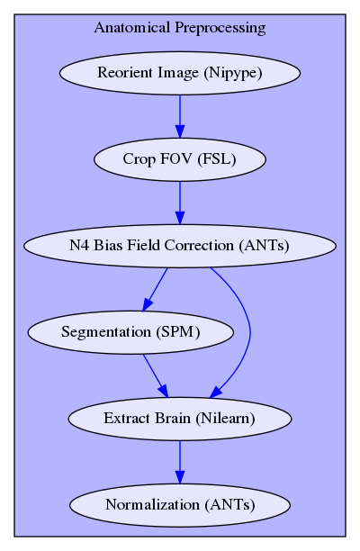

After anatomical preprocessing the following output figures are generated:

### Tissue Segmentation of T1w
This panel shows quality of the T1-weighted image segmentation, with brain tissues highlighted in green for Gray Matter (GM), in beige for White Matter (WM) and in blue for Cerebral Spinal Fluid (CSF).

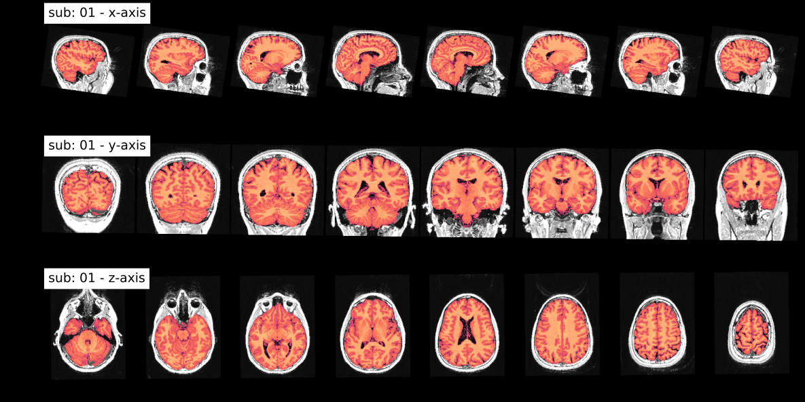

### Brain Extraction of T1w
This panel shows the quality of the brain extraction. The brain highlighted in red is overlayed on the subject specific T1-weighted image in gray.

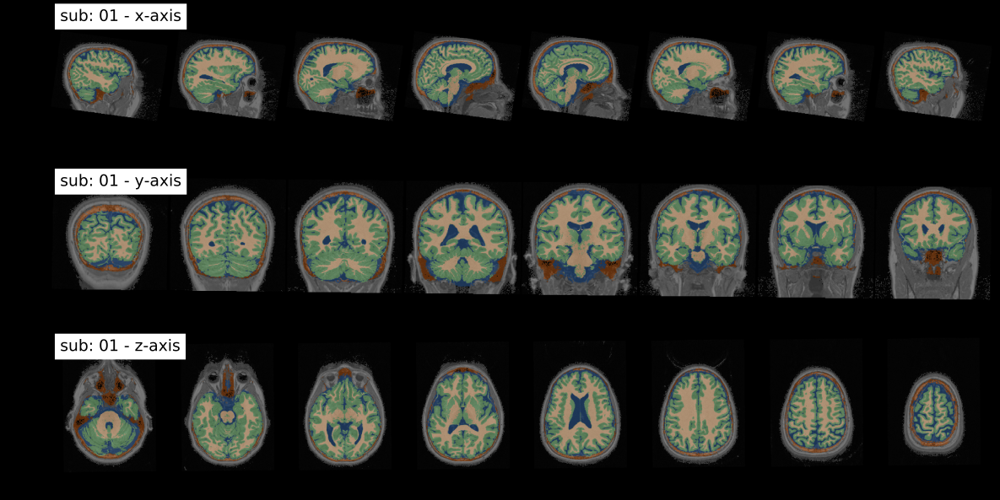

### T1w to MNI registration
This panel shows the quality of the nonlinear template registration. The normalized brain highlighted in yellow is overlayed on the ICBM T1-weighted template image in gray. Regions in red and blue show negative and positive deformation discrepancy between the normalized subject image and the template.

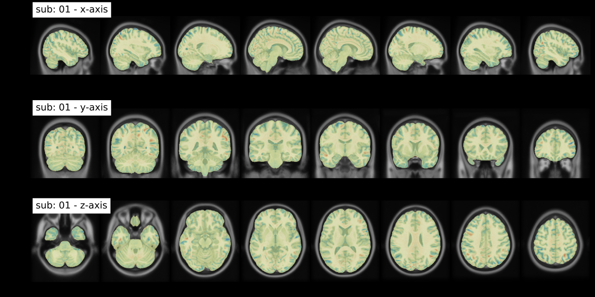

## 02_preproc_func.ipynb

The notebook [02_preproc_func.ipynb](https://nbviewer.jupyter.org/github/miykael/fmriflows/blob/master/notebooks/00_spec_preparation.ipynb) contains perform functional preprocessing. Parameters that can be specified in the [`fmriflows_spec_preproc.json`](https://github.com/miykael/fmriflows/blob/master/static/fmriflows_spec_preproc.json) file are the following:

 - `subject_list_func`: List of subject identifier to preprocess
 - `session_list_func`: List of session identifier to preprocess (set to `[]` if dataset doesn't contain session identifiers)
 - `task_list`: List of task identifier to preprocess
 - `run_list`: List of run identifiers (`int`) to preprocess (set to `[]` if dataset doesn't contain session identifiers)
 - `ref_timepoint`: Reference timepoint for slicetime correction, in milliseconds
 - `res_func`: Isometric resample resolution for after image coregistration
 - `filters_spatial`: List of spatial filters to apply. Use `LP` for lowpass, `HP` for highpass and `BP` for bandpass spatial filtering. For example [[`LP`, 6.0], [`HP`, 2.0]] will run the analysis once with a spatial lowpass filter of FWHM=6mm and once with a spatial highpass filter of FWHM=2mm.
 - `filters_temporal`: List of temporal filters to apply. First element will define lowpass, second highpass cutoff. Use `None` to not use given filter. For example `[[5.0, 100.0], [5.0, 100.0]]` will run the analysis once with a temporal lowpass filter of 5Hz and highpass filter of 100Hz, and once with a temporal filter of only a highpass filter of 100Hz.,
 - `n_compcor_confounds`: Number of anatomical and functional CompCor componenets to compute. Defautl is 5.
 - `outlier_thresholds`: Thresholds used to performe outlier detection on FD, DVARS, TV, GM, WM and CSF. Use `None` if parameter shouldn't be used for outlier detection.
 - `n_independent_components`: Number of ICA components that should be estimaed. Default is 10.

The simplified workflow of the anatomical preprocessing looks as follows:

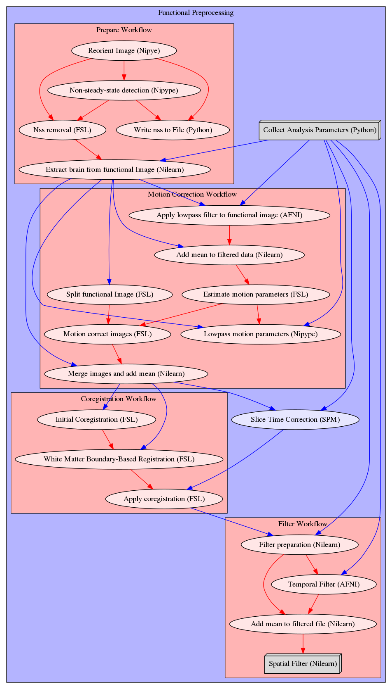

Additionally to the preprocessing, the following signal confounds are computed:
 - Friston's 24-parameter model for motion parameters
 - Framewise Displacement (FD) and DVARS
 - Average signal in total volume (TV), in GM, in WM and in CSF
 - Anatomical and temporal CompCor components
 - Independent components in image before smoothing

After functional preprocessing the following output figures are generated:

### Mean Image and CompCor Masks
This panel shows the mean functional image in gray, and the brainmask (red) that was used to compute DVARS and the temporal (green) and anatomical (yellow) CompCor mask.

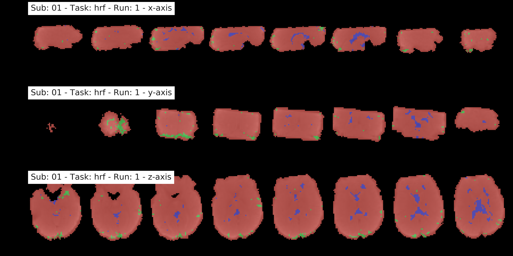

### Carpet plot of the temporal filtered functional image
This panel shows the signal for (almost) every voxel (y-axis), over time in volumes (x-axis). The panel shows voxel in the gray matter (top part), white matter (between blue and red line) and CSF (bottom section). The data was standardized to the global signal, and ordered within a given region according to correlation coefficient to the average signal.

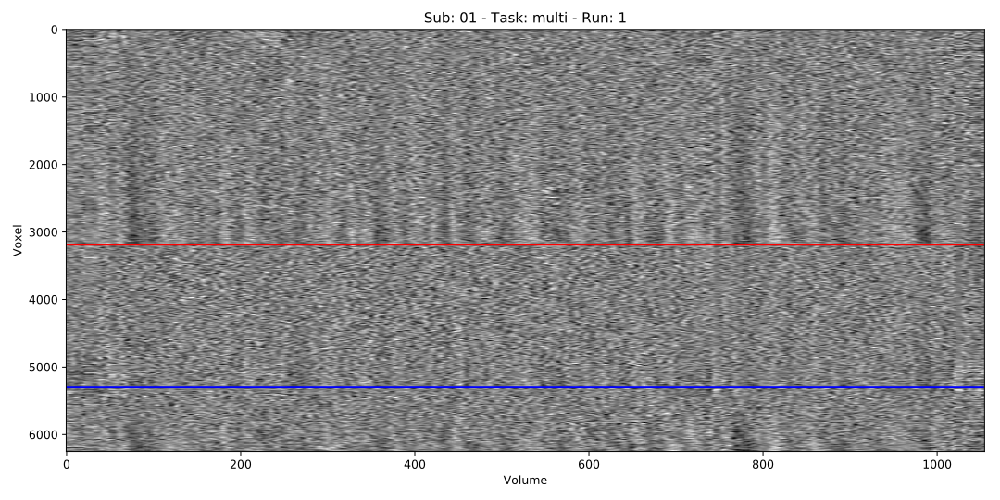

### Main confounds with highlighted outliers
This panel shows the main confounds. Shown are FD (Framewise Displacement) and DVARS, as well as the average signal in TV (total brain volume), GM (gray matter), WM (white matter) and CSF (cerebral spinal fluid). Vertical lines in black indicate outliers, as defined by threshold values.

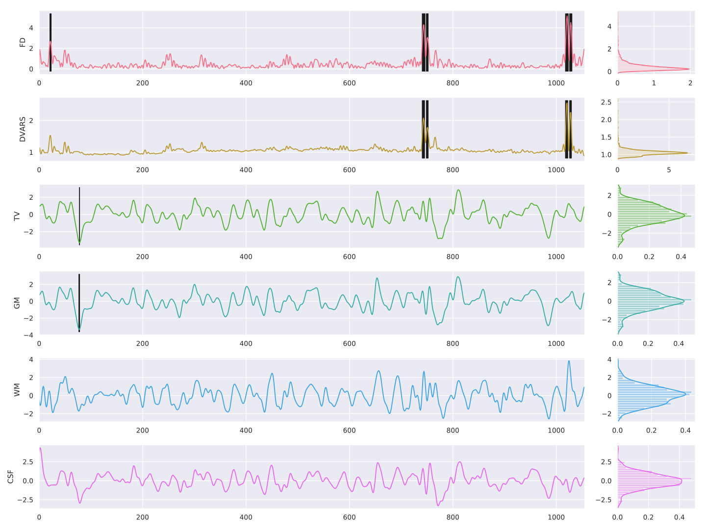

### Motion Parameters
This panel shows the motion parameters.

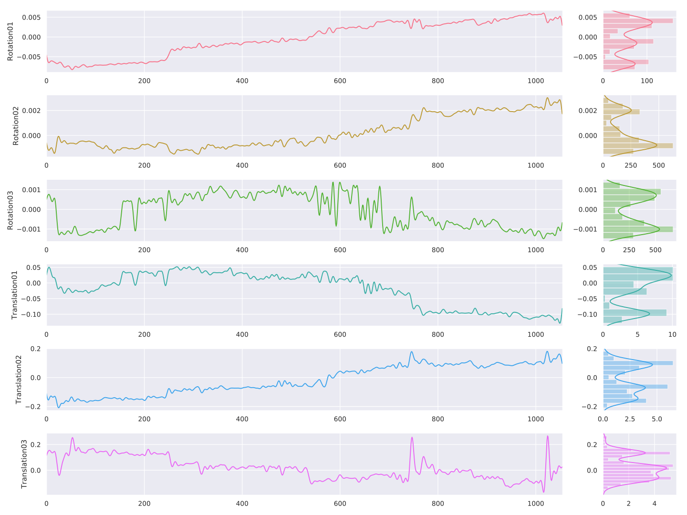

### Anatomical CompCor Components
This panel shows the anatomical CompCor components.

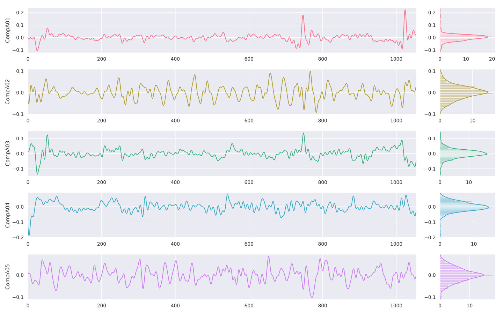

### Temporal CompCor Components
This panel shows the temporal CompCor components.

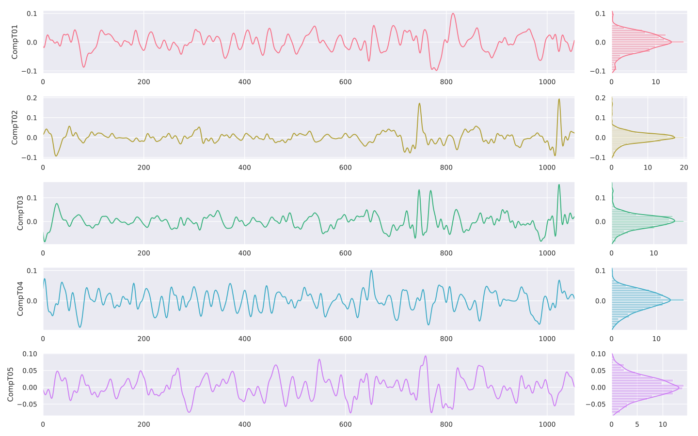

### ICA Components
This panel shows the ICA components. Left side of the figure shows the correlation between the component and the functional image, over time. The right panel shows the power spectrum density of this component, with values in Hz on the x-axis.

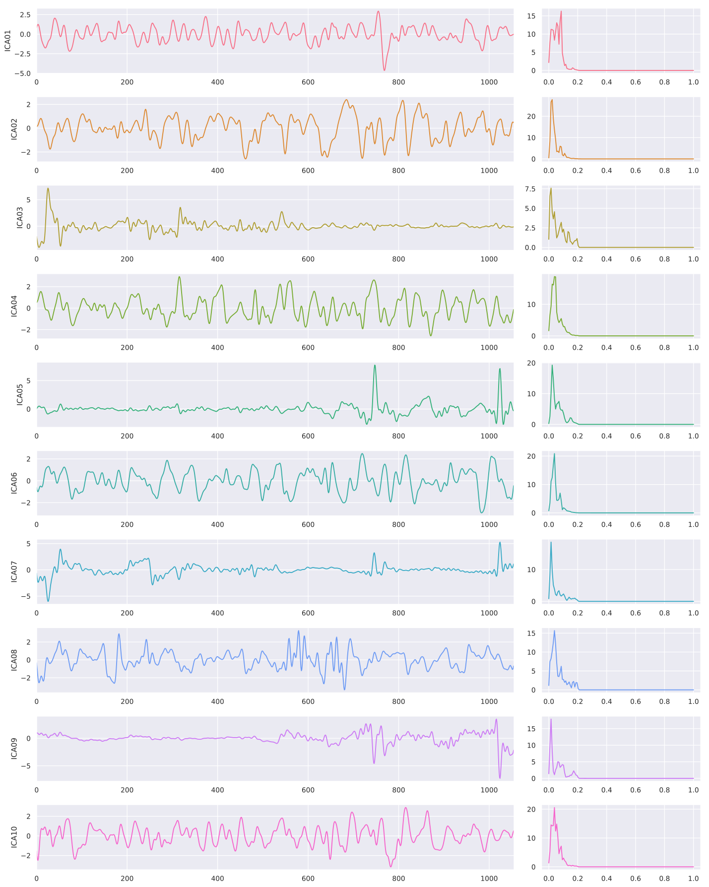

This panel shows the load of the ICA components within the brain volume.

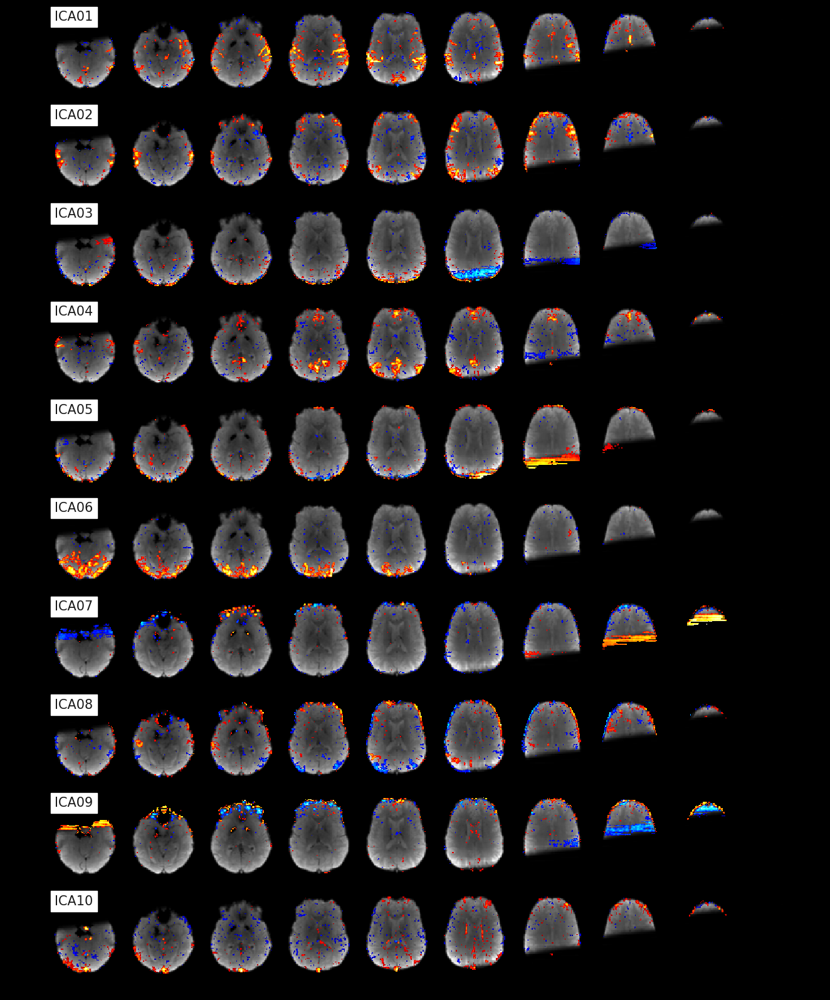

# Feedback, Help & Support

If you want to help with this project or have any questions, fell free to fork the repo, send us a pull request or open a new [issue on github](https://github.com/miykael/fmriflows/issues). Every help is highly appreciated, every feature request or bug report is very welcomed.


# Thanks and Acknowledgment

We would like to thank everybody who's developing code for [Nipype](https://github.com/nipy/nipype), [fmriprep](https://fmriprep.readthedocs.io/en/stable/), [Nilearn](https://github.com/nipy/nipype), [PyMVPA](http://www.pymvpa.org/) and many other related open-source toolboxes. We were able to integrate their knowledge, code and approaches in `fmriflows`, because their code is open.

Thanks also to all the contributors, tester, bug reporter and feedback giver to `fmriflows`. And a special thanks to [Faruk](https://github.com/ofgulban) who created the great `fmriflows` logo.
